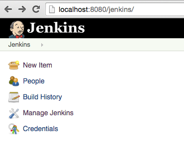
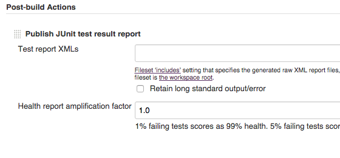

# Jenkins CI docs - Execute shell steps

## Prerequisites

* Must have [node.js (at least v0.10+)](http://nodejs.org/) installed with npm (Node Package Manager)

## Config Steps

### 00 - define new jenkins job

* on Jenkins home, click on New item

* select `freestyle project` and define item name `cmd - Jenkins CI and Karma jUnit Report`

* click on OK button

### 01 - source code management : git

* select git

* add repository url: `https://github.com/erkobridee/jenkins-ci-and-karma-junit-reporter`

### 02 - build

* on `Add Build step` combobox select `Execute shell`

* define command `npm test`

### 03 - post-build actions

* on `Add post-build action` combobox select `Publish JUnit test result report`

* on `Test report XMLs` field define `tests_out/junit/*.xml`

### 04 - save

* click on save button at page bottom

## Running one Build

* on Project home, at left sidebar menu click on `Build Now`
